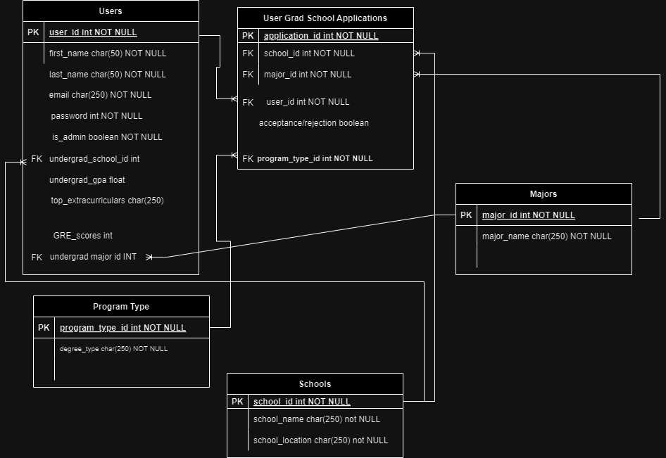
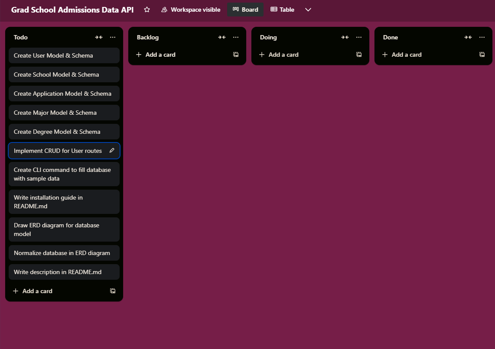
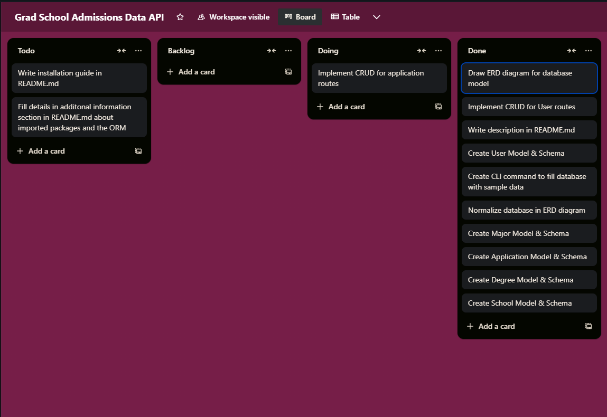
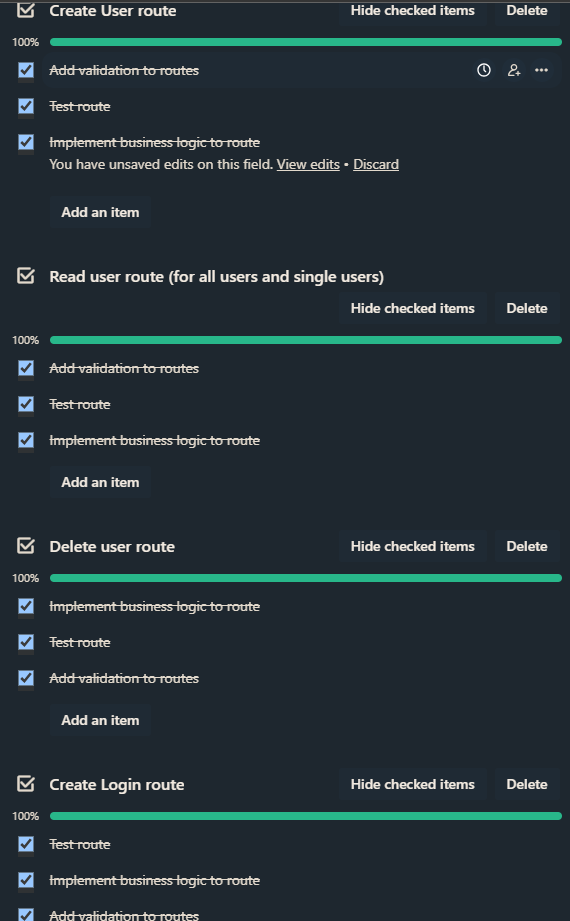
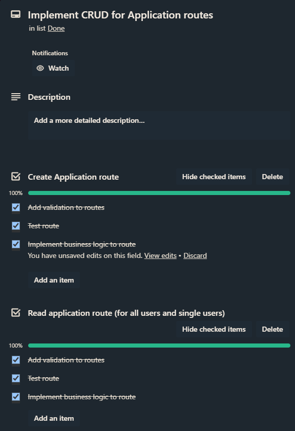
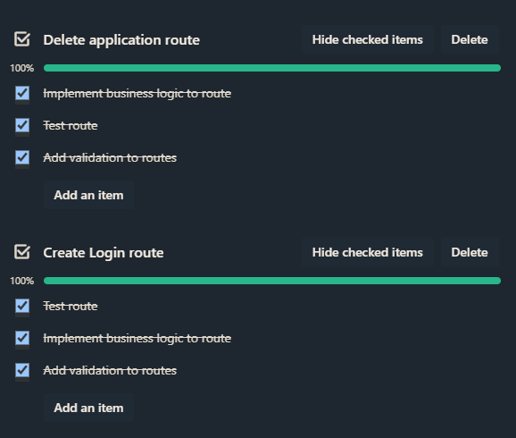

# Grad School Admissions Data API

## Github Repo

[Github Project Link](https://github.com/duskpeyl/GradX-Graduate-School-Admissions-API)

## Description

College admissions is a difficult process.

Especially so for the 1.1 million members of the community [r/ApplyingToCollege](https://www.reddit.com/r/ApplyingToCollege/), many of which are obsessed with so-called ["T20 universities"](https://www.usnews.com/best-colleges/rankings/national-universities). A term referring to universities ranked amongst top 20 national universities in the United States, typically ranked by publications such as U.S. News & World Report.

Selective universities within the T20 receive an upwards of [60,000 applications](https://www.forbes.com/sites/christopherrim/2024/03/29/this-year-was-a-historic-ivy-league-application-season-heres-what-you-need-to-know/) in a given year, making it truly difficult for students have a clearer understanding and grasp of their standing amongst other applicants.

For those who are slightly older and have already graduated from university, many of these universities are also popular destinations for students aiming for postgraduate programs. [GradX](https://github.com/duskpeyl/GradX-Graduate-School-Admissions-API) is merely a REST API that aggregates self-reported postgraduate admissions data from top university programs and seeks to resolve that problem for aspiring postgraduate students, by allowing users to compare their applications to other candidates based on their extracurriculars, standardized testing scores and grades.

### Features

- **User Registration and Authentication**:
  - **Sign Up**: Users can create an account by providing an email and password.
  - **Login**: Registered users can log in using their credentials.

- **Profile Management**:
  - **View Profile**: Users can view their profile information on their account.
  - **Edit Profile**: Users can update their personal information on their account.
  - **Delete Profile**: Users can delete their profile.

- **Application Management**:
  - **Add Application**: Users can add new application records, including details such as GPA, GRE scores, and application status.
  - **View Applications**: Users can view other people's applications and compare their stats.
  - **Update Application**: Users can edit their existing application details.
  - **Delete Application**: Users can remove an application if needed.
  
## Code Style 

The code for this project was styled according to [the PEP 8 Style Guide by Guido van Rossum, Barry Warsaw, and Alyssa Coghlan.](https://peps.python.org/pep-0008/)
  
## Implementation Plan

### Entity Relationship Diagram for Database (ERD)


**One-to-Many Relationships:**

> Users to Applications: Each user can submit multiple applications.

**Many-to-One Relationships:**

> Applications to Schools: Many applications can be made to one school.

> Applications to Majors: Many applications can target one major.

> Applications to Degree Types: Many applications can be for one degree type.

> Users to Undergraduate School: Each user attends one undergraduate school.

> Users to Undergraduate Major: Each user has one undergraduate major.

### Overall Plan









### Dependencies  

* blinker==1.8.2
* click==8.1.7
* Flask==3.0.3
* greenlet==3.0.3
* itsdangerous==2.2.0
* Jinja2==3.1.4
* MarkupSafe==2.1.5
* marshmallow==3.21.3
* marshmallow-sqlalchemy==1.0.0
* packaging==24.0
* SQLAlchemy==2.0.30
* typing_extensions==4.12.2
* Werkzeug==3.0.3

### Imported Packages

* flask
* marshmallow-sqlalchemy
* flask-jwt
* flask-marshmallow
* flask-sqlalchemy
* psycopg2-binary
* bcrypt
* python-dotenv

## Functions/API Manual Page

### User Management API Documentation

### `POST /users/login`

**Description:**
Handles user login by validating email and password, and generating a JWT token.

**Request Body:**
```json
{
  "email": "user@example.com",
  "password": "password123"
}
```

**Responses:**

`200 OK` on successful login:

```json
{
  "token": "<generated_JWT_token>"
}
```

`401 Unauthorized` if invalid email or password:

```json
{
  "error": "invalid email or password."
}
```

### `POST /users/`

**Description:**
Registers a new user by creating an account with provided details.

**Request Body:**

```json
{
  "first_name": "John",
  "last_name": "Doe",
  "email": "john.doe@example.com",
  "password": "securepassword"
}
```

**Responses:**

`201 OK` on successful registration:

```json
{
  "id": 1,
  "first_name": "John",
  "last_name": "Doe",
  "email": "john.doe@example.com"
}
```

`400 Bad Request` if missing required fields or invalid data format.

### `GET /users/`

**Description:**
Retrieves details of all user accounts in the database (admin-only access).

**Request Header:**

```json
Authorization: Bearer <JWT_token>
```

**Responses:**

`200 OK` on successful retrieval:

```json
[
  {
    "id": 1,
    "first_name": "John",
    "last_name": "Doe",
    "email": "john.doe@example.com"
  },
  {
    "id": 2,
    "first_name": "Jane",
    "last_name": "Smith",
    "email": "jane.smith@example.com"
  }
]
```

`401 Unauthorized` if the token is missing or invalid.

`403 Forbidden` if the user lacks admin privileges.

### `GET /users/{id}`

**Description:**
Retrieves details of a specific user account by their ID.

**Request Headers:**

```json
Authorization: Bearer <JWT_token>
```

**Responses:**

`200 OK` on successful retrieval:

```json
{
  "id": 1,
  "first_name": "John",
  "last_name": "Doe",
  "email": "john.doe@example.com"
}
```

`401 Unauthorized` if the token is missing or invalid.

`403 Forbidden` if the user is not authorized to access the resource.

`404 Not Found` if the user with the specified ID does not exist.

### `PUT /users/{id}` or `PATCH /users/{id}`

**Description:**
Updates details of a specific user account by their ID.

**Request Headers:**

```json
Authorization: Bearer <JWT_token>
```

**Request Body (Example for PATCH):**

```json
{
  "first_name": "Updated John"
}
```

**Responses:**

`200 OK` on successful update:

```json
{
  "id": 1,
  "first_name": "Updated John",
  "last_name": "Doe",
  "email": "john.doe@example.com"
}
```

`401 Unauthorized` if the token is missing or invalid.

`403 Forbidden` if the user is not authorized to update the resource.

`404 Not Found` if the user with the specified ID does not exist.

### `DELETE /users/{id}`

**Description:**
Deletes a specific user account by their ID.

**Request Headers:**

```json
Authorization: Bearer <JWT_token>
```

**Responses:**

`200 OK` on successful deletion:

```json
{
  "message": "User account deleted successfully."
}
```
`401 Unauthorized` if the token is missing or invalid.

`403 Forbidden` if the user is not authorized to delete the resource.

`404 Not Found` if the user with the specified ID does not exist.

## `POST /applications/`

**Description:**
Creates a new application by adding it to the database.

**Request Body:**
```json
{
  "status": "pending",
  "school_id": 1,
  "major_id": 2,
  "user_id": 1
}
```
**Responses:**

`201 OK` on successful creation:

```json
{
  "id": 1,
  "status": "pending",
  "school_id": 1,
  "major_id": 2,
  "user_id": 1
}
```

`400 Bad Request` if missing required fields or invalid data format.

### `GET /applications/`

**Description:**
Retrieves details of all applications in the database.

**Request Headers:**

```json
Authorization: Bearer <JWT_token>
```

**Responses:**

`200 OK` on successful retrieval:

```json
[
  {
    "id": 1,
    "status": "pending",
    "school_id": 1,
    "major_id": 2,
    "user_id": 1
  },
  {
    "id": 2,
    "status": "accepted",
    "school_id": 3,
    "major_id": 4,
    "user_id": 1
  }
]
```

`401 Unauthorized` if the token is missing or invalid.

### `GET /applications/{id}

**Description:**
Retrieves details of a specific application by its ID.

**Request Headers:**

```json
Authorization: Bearer <JWT_token>
```

**Responses:**

`200 OK` on successful retrieval:

```json
{
  "id": 1,
  "status": "pending",
  "school_id": 1,
  "major_id": 2,
  "user_id": 1
}
```

`401 Unauthorized` if the token is missing or invalid.

`404 Not Found` if the application with the specified ID does not exist.

### `PUT /applications/{id} or PATCH /applications/{id}`

**Description:**
Updates details of a specific application by its ID.

**Request Headers:**

```json
Authorization: Bearer <JWT_token>
```

**Request Body (Example for PATCH):**
```json
{
  "status": "accepted"
}
```

**Responses:**

200 OK on successful update:

```json
{
  "id": 1,
  "status": "accepted",
  "school_id": 1,
  "major_id": 2,
  "user_id": 1
}
```

`401 Unauthorized` if the token is missing or invalid.
`403 Forbidden` if the user is not authorized to update the resource.
`404 Not Found` if the application with the specified ID does not exist.

### `DELETE /applications/{id}`

**Description:**
Deletes a specific application by its ID.

**Request Headers:**

```json
Authorization: Bearer <JWT_token>
```

**Responses:**

`200 OK` on successful deletion:
```json
{
  "message": "Application deleted successfully."
}
```

`401 Unauthorized` if the token is missing or invalid.

`403 Forbidden` if the user is not authorized to delete the resource.

`404 Not Found` if the application with the specified ID does not exist.

## Installation Guide 

### Step 1: Download the Project from Github

To run this terminal application, simply navigate to the green code button on the Github repository and press 'Download ZIP'.

### Step 2: Unzip the Project

After installing the project in the form of a zip file, unzip the project and change the permissions of the bash script from the file within the command line, with the following commands:

> cd ~/Downloads/GradX-Graduate-School-Admissions-API/src

> chmod +x Run_GradX_Flask_API.sh

This will give permissions for your computer to execute the file.

### Step 3: Database PostgreSQL permissions

> remove ".sample" from .env

Afterwards, create a user and db, and add a DB_URI (database connection string) and any secret key for JWT tokens to .env.

### Step 4: Run the Program

Once you have changed the permissions of the bash script within the root directory of the unzipped project and configured .env, run the following command:

> bash Run_GradX_Flask_API.sh

This will automatically download all of the dependencies needed for the program to run, then start flask itself.

## Additional Information

### How were the imported packages and dependencies used in this app?

* Flask and Flask Extensions: Facilitate web server functionality and HTTP request handling.

* SQLAlchemy: Enables ORM-based database interactions for Flask, simplifying database operations.

* marshmallow: Used for data serialization and validation.

* bcrypt: Provides secure password hashing for user authentication.

* psycopg2-binary: PostgreSQL adapter for Python for database connectivity to Flask.

* python-dotenv: Loads environment variables from a .env file into the application for configuration.

### Why did I use an ORM for this project?

SQLAlchemy interacts with the database model using Python instead of raw SQL. I find that this reduces the amount of boilerplate code I need to write and makes it faster to iterate over in terms of testing and development.

SQLAlchemy and Flask require both little overhead for developers to run, whereas setting up a project without these libraries handling HTTP requests, routing, url handling, networking, database integration and database queries require a more in-depth understanding of web development, networking and databases. It's a lot of unnecessary work for setting up an API webserver, thus why I decided to use an ORM for this project.

### How did database normalization affect the project database model?

### Benefits and drawbacks of using PostgreSQL

## References

* Python Software Foundation (2024). Datetime — Basic Date and Time Types — Python 3.12.3 Documentation. [online] Python.org. Available at: [Link to datetime library](https://docs.python.org/3/library/datetime.html).
* GNU (2022). Bash Reference Manual. [online] Available at: [Link to Bash Manual](https://www.gnu.org/software/bash/manual/bash.html).
* Van Rossum, G., Warsaw, B. and Coghlan, N. (2023). PEP 8 – Style Guide for Python Code | peps.python.org. [online] peps.python.org. Available at: [Link to PEP Guide](https://peps.python.org/pep-0008/).
* Flask (2024). Flask documentation. [online] Available at: [Link to Flask Documentation](https://flask.palletsprojects.com/en/3.0.x/).
* Marshmallow (2024). Marshmallow Documentation. [online] marshmallow.readthedocs.io. Available at: [Link to Marshmallow library](https://marshmallow.readthedocs.io/en/stable/).
* SQLAlchemy (2024). SQLAlchemy Documentation. [online] docs.sqlalchemy.org. Available at: [Link to SQLAlchemy library](https://docs.sqlalchemy.org/en/20/).